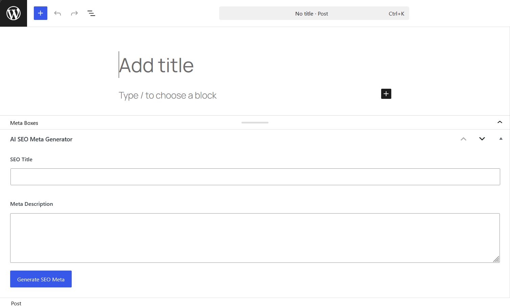
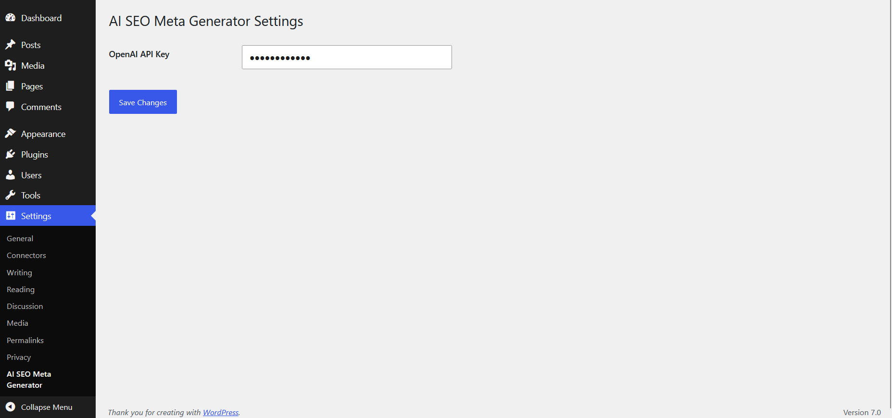
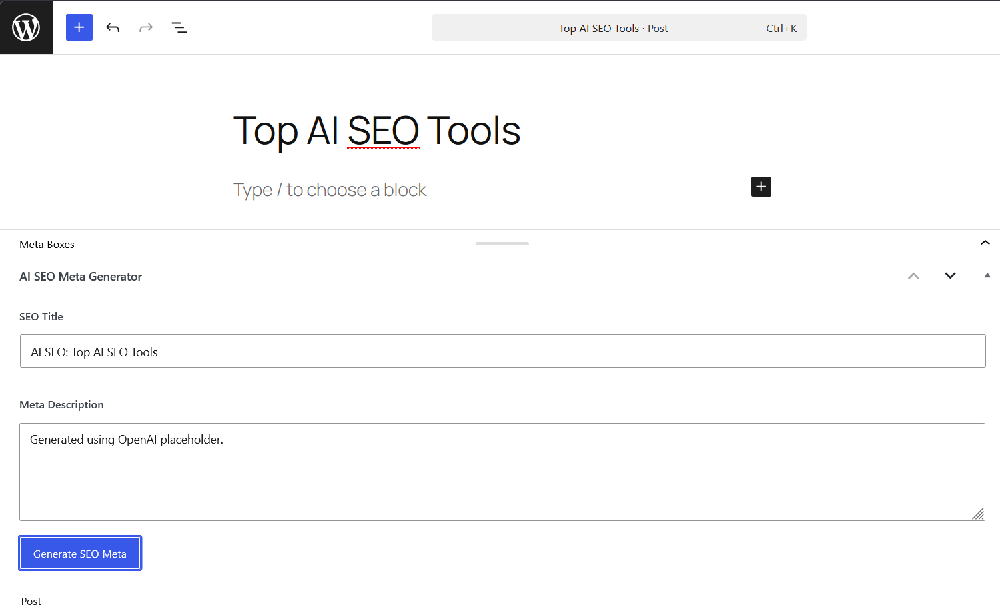

# AI SEO Meta Generator

A production-ready WordPress plugin that generates SEO titles and meta descriptions using AI-powered workflows. Built with OOP PHP, AJAX, WordPress Hooks, Settings API, and an OpenAI-ready architecture.

## Overview

AI SEO Meta Generator helps WordPress users create SEO-friendly metadata directly inside the post editor. The plugin provides a custom meta box, AJAX-powered generation, secure data handling, and a scalable architecture designed for future AI integrations.

## Features

* Custom SEO Meta Box in the WordPress Post Editor
* AJAX-Based SEO Metadata Generation
* Editable SEO Title Field
* Editable Meta Description Field
* Secure Nonce Verification
* WordPress Settings Page
* OpenAI API Ready Structure
* OOP (Object-Oriented Programming) Architecture
* Secure Post Meta Storage
* Clean Plugin Folder Structure
* Uninstall Cleanup Support

## Screenshots

### SEO Meta Box

Custom WordPress meta box for generating SEO metadata.



### Settings Page

Plugin settings page prepared for OpenAI API integration.



### Generated SEO Metadata

Generated SEO title and meta description using the AJAX-powered workflow.



## Project Structure

```text
ai-seo-meta-generator/
│
├── admin/
│   └── views/
│       └── meta-box-ui.php
│
├── assets/
│   └── js/
│       └── admin.js
│
├── includes/
│   ├── api/
│   │   └── class-openai.php
│   │
│   ├── class-ai-generator.php
│   ├── class-meta-box.php
│   └── class-settings.php
│
├── uninstall.php
├── README.md
└── ai-seo-meta-generator.php
```

## Skills Demonstrated

* WordPress Plugin Development
* PHP OOP (Object-Oriented Programming)
* WordPress Hooks and Actions
* AJAX Requests and Responses
* WordPress Settings API
* WordPress Options API
* Post Meta Management
* Nonce Verification and Security
* Plugin Architecture Design
* API Integration Preparation
* GitHub Project Management

## Technologies Used

* PHP
* WordPress
* JavaScript
* AJAX
* HTML
* CSS
* MySQL

## Installation

1. Download or clone this repository.
2. Copy the plugin folder into:

```text
wp-content/plugins/
```

3. Activate the plugin from the WordPress Admin Dashboard.
4. Navigate to:

```text
Settings → AI SEO Meta Generator
```

5. Configure your API settings.
6. Open any post and use the AI SEO Meta Generator meta box.

## Usage

1. Create or edit a WordPress post.
2. Enter a post title.
3. Click the "Generate SEO Meta" button.
4. Review the generated SEO title and meta description.
5. Edit the generated content if needed.
6. Save or publish the post.

## Current Version

Version: 1.0.0

## Roadmap

### Version 1.1.0

* Real OpenAI API Integration
* Loading Spinner During Generation
* Better Error Handling
* Success Notifications

### Version 1.2.0

* SEO Title Character Counter
* Meta Description Character Counter
* Improved User Experience

### Version 1.3.0

* Bulk SEO Metadata Generation
* Custom Post Type Support
* SEO Recommendations

### Future Enhancements

* OpenAI GPT Integration
* Gemini AI Integration
* SEO Score Analysis
* Keyword Suggestions
* Schema Markup Suggestions
* Multilingual Support

## Security Features

* Nonce Verification
* Input Sanitization
* Output Escaping
* Direct File Access Protection
* WordPress Capability Checks

## Why This Project

This project was built to demonstrate modern WordPress plugin development practices, including OOP architecture, AJAX workflows, secure coding standards, admin interfaces, and AI-ready integrations.

## Author

Yudhishter Sukhija

Website: https://yudhishtersukhija.com

## License

GPL v2 or later

This project is open-source and available under the GPL license.
